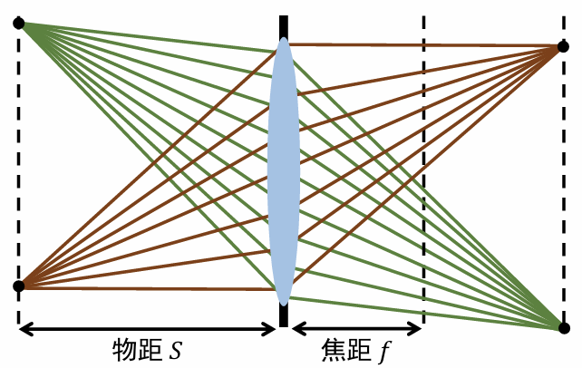
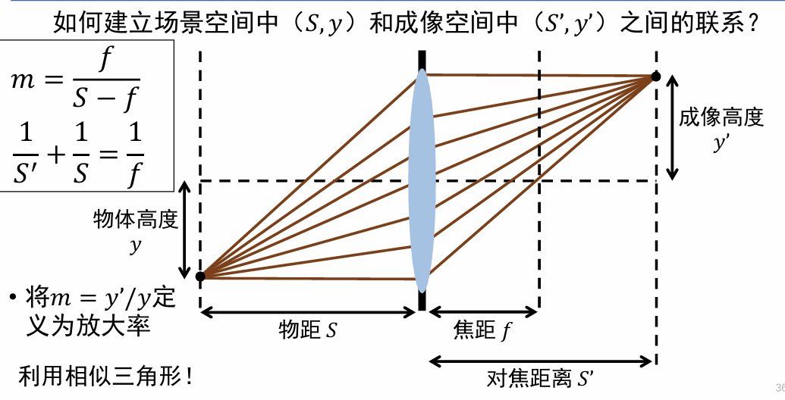
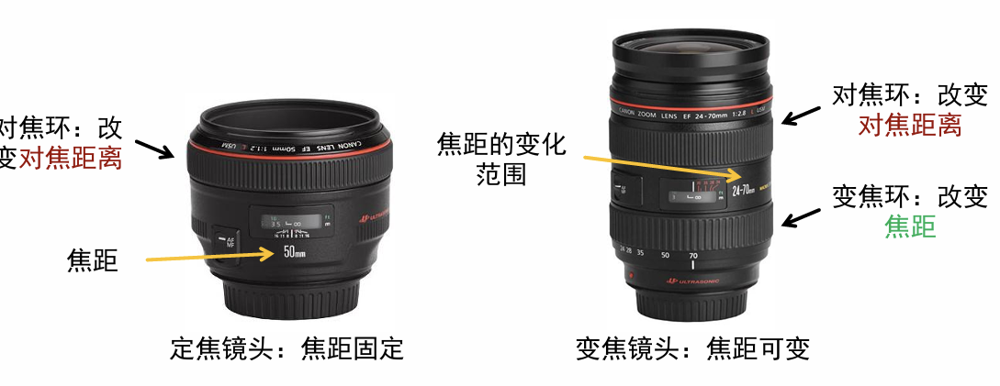
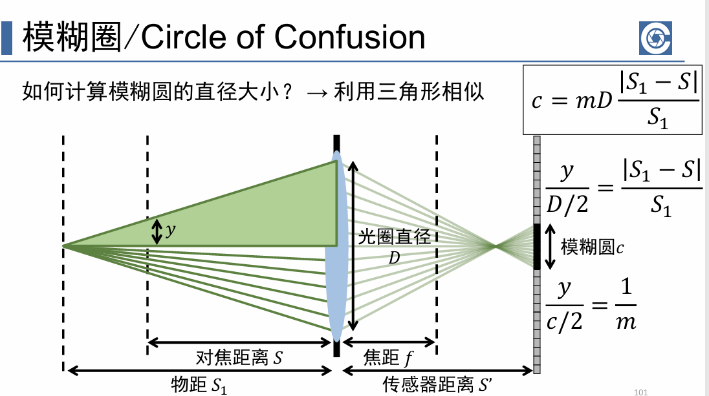
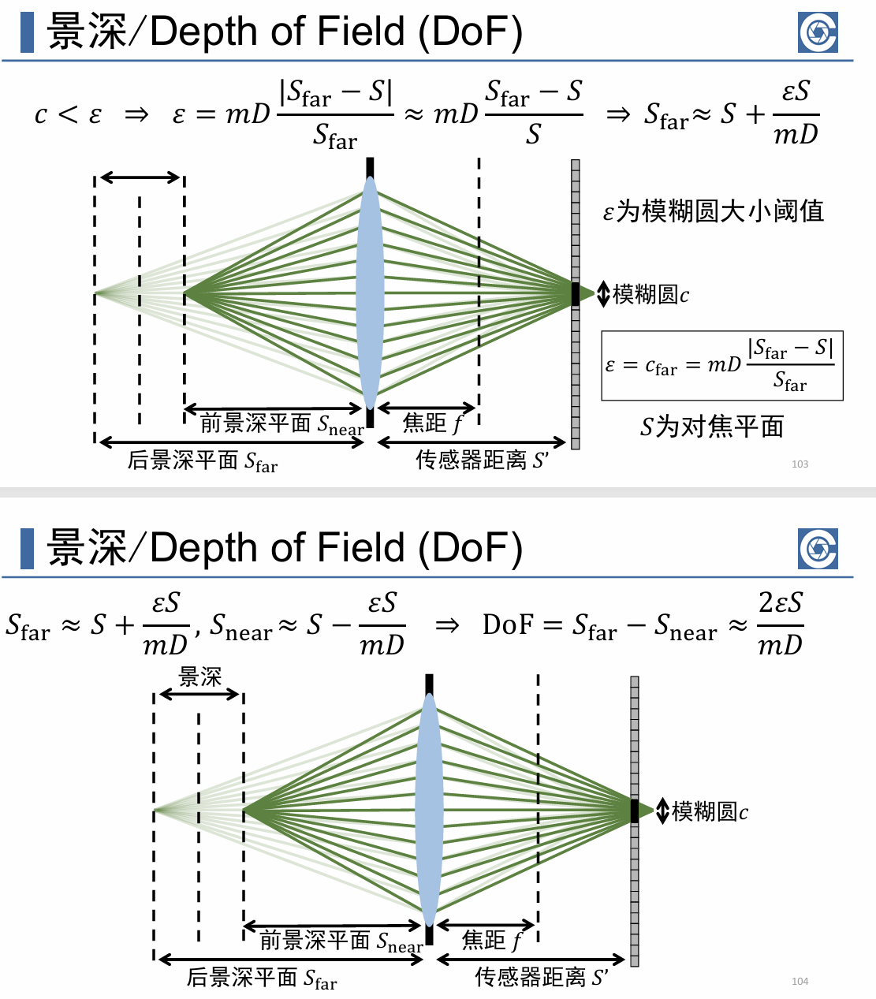

# 镜头、曝光、对焦
## 镜头代替小孔实现更清晰的成像
**薄透镜模型**
1. 光线穿过透镜中心不改变传播方向
2. 平行光束穿过透镜后在对焦平面上汇聚于一点
*对焦平面和透镜的距离是焦距*

>一个物体向所有方向发射出一束光线，如何通过透镜传播？
    从这些光线中穿过透镜中心的那条光线入手；
    而其他光线则找到与他们平行的穿过透镜中心的光线，与对焦平面的交点就是所求的汇聚点。

>定义辨析
焦距是镜头的固有属性，平行光进入镜头后汇聚成一个点时，这个焦点到镜头光学中心的距离。
而对焦距离是被摄物体（或者镜头光学中心）到相机传感器（底片）之间的距离。
物距是物体到镜头的距离。

但是并不是物体上所有点都可以被准确对焦到传感器上。也就是说我们控制不同的
成像平面的位置的时候，可以实现对物体上不同深度点的清晰。

而那些未能成功在平面上成像的点在平面上形成的模糊圈，就被称为弥散圆。

核心公式$\frac{1}{f}=\frac{1}{u}+\frac{1}{v}$
u是对焦距离，v是像距。

**当然，更严重的问题是，真实的透镜与理论薄透镜的成像还是有很大的区别的。这被称为像差。**

## 视场：光学仪器的视野范围
**变焦，即改变镜头的焦距，要与改变对焦距离加以区分**
焦距越大或者对焦距离越大，Fov越小
减小传感器大小，Fov也对应减小

# 曝光控制
三要素：快门、光圈、感光度
光圈f-number：焦距/光圈口径
光圈控制进光面积

# 景深
对焦平面前后图像看起来清晰的范围。

而模糊圆的大小是被光圈控制的，因此光圈与景深大小成反比。

**比如背景虚化，就是需要浅景深，就是需要调大光圈**

# 虚拟大光圈摄像
手机硬件限制：焦距短、光圈小。
