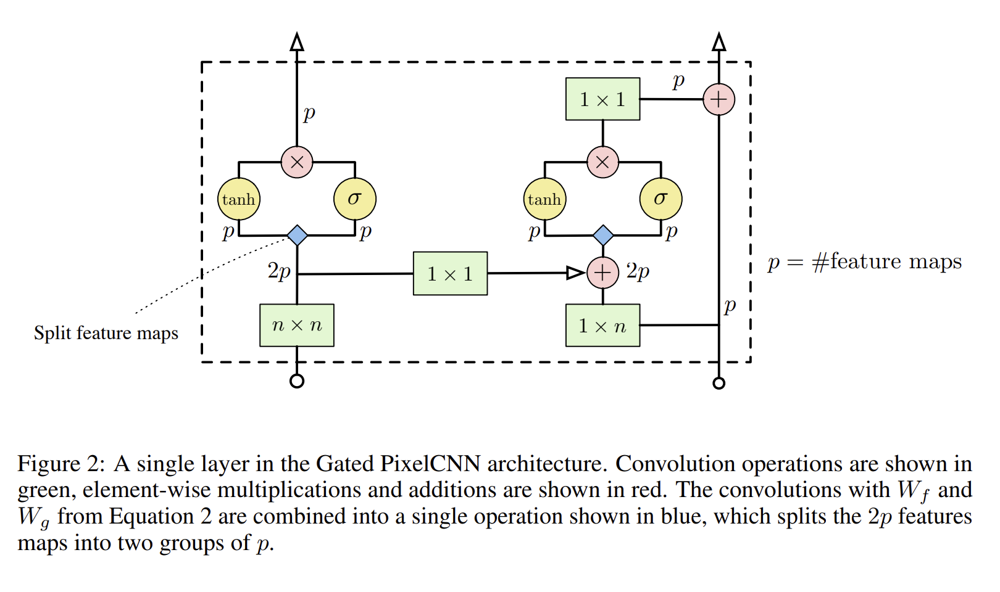

# Conditional Image Generation with PixelCNN Decoders
本次作业主要涉及的是自回归模型在生成任务中的使用方法。

## 关于PixelCNN的基本思路以及盲点问题
https://zhuanlan.zhihu.com/p/632209862

就跟GPT一样，自回归模型的关键在于控制模型到底能看到多少内容，一定要避免模型看到要预测的位置之后的内容，但是要尽可能保证模型看到要预测的位置之前的内容。

模型太喜欢偷懒了，真的真的一定要避免向模型泄露他要预测的东西的信息
关注Loss，如果train不动考虑模型架构本身的问题，主要是梯度为什么传不动，而如果Loss掉的很快，比如这次直接掉到0了，就要警惕模型是否学到什么不该学的东西了。