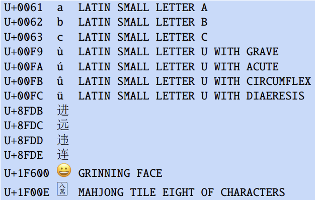
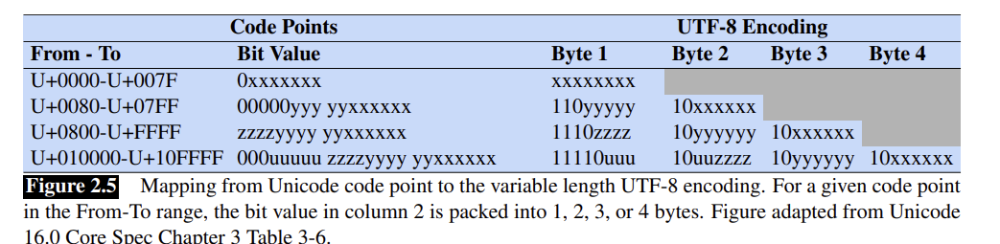
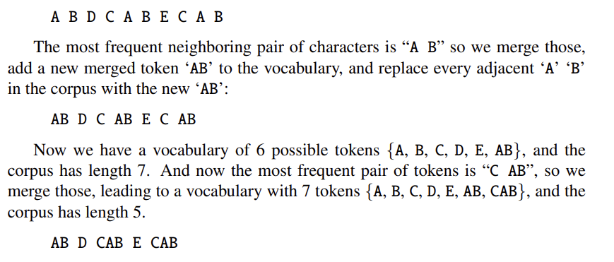
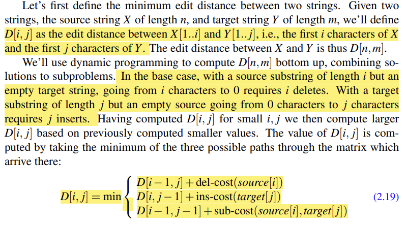
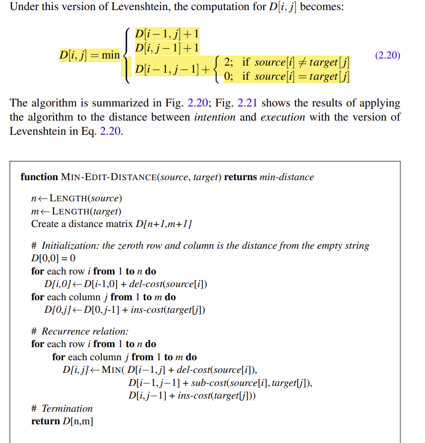
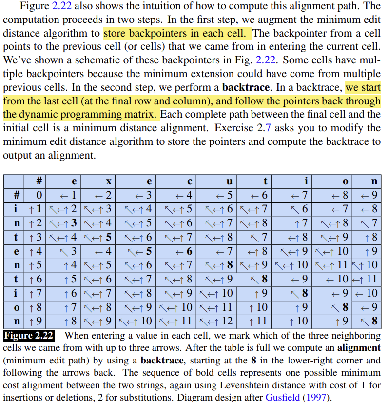

# Words and Tokens
## Words
- 话语中的停顿的理解：大多数时候我们把它删除，但是它有的时候也有用，因为它们可能象征着演讲者重开了重开了一个新的想法。

- $|V|=kN^{\beta}$
粗略我们可以理解一段文字的词汇量是它的总词语数目的的平方根。这是一个很严重的问题，因为随着文章体量的增大，它涉及的词汇数目也会不断地变大。我们终究会遇到vocabulary里面不存在的单词。

- 在NLP中，我们一般使用**subword**来帮助模型更好地辨认和推测一些未见过地词汇的意思。

## Morphemes
每个词语都可以分成多个部分，每个部分也有自己单独的语义。

在计算词语tokenization过程中，不同语言有不同的特征：
- 每个词语中morphemes的数量
- Morphemes之间的边界是否是清晰可分的

## Unicode
### code points
用十六进制数字给所有可能出现的符号进行编码。

### UTF-8 Encoding
为了更好地和原先的ASCII码适配以及节省空间，UTF-8是一种可变长度的编码方式。

## Subword Tokenization:Byte-Pair Encoding
### BPE
- 设定一个收敛值，一个初始词汇表（可能是所有英文字母），以及把待训练语句拆分成为最小单位的tokens。
- 在训练语句中找到最常相邻出现的两个词，把它们作为一个新的token放入词汇表，并且记录相应合并的两个词
- 把所有新token对应的相邻字符连接起来，然后重复迭代过程。

**注意很多时候我们需要把空格也作为一个token放进去，帮助我们分辨不同的re,比如reply和metre**

### BPE Encoder
经过训练之后，在实际测试的时候我们把新语句输入encoder，然后我们就不再往vocabulary里面放新的词汇了。
由于我们记录了曾经的合并顺序，所以我们按照训练的时候记录合并次序从前到后进行合并。

## Corpora-语料库
- 语言
- 题材
- 作者的个性
- 时代背景、时间

## Regular Expressions

## Rule-Based tokenization

## Minimum Edit Distance
用于比较两个词语或者两个字符串的相似程度。

*Edit distance*
通过最小的诸如插入、删除、替换一类的变换操作次数，把一个字符串编程另外一个字符串。
- 任何一个替换变换都可以表示为一个插入+一个删除。

### 算法

