# N-gram Language Models
- 语言模型就是一个机器学习模型，它可以预测下一个单词。
- 更正式的说，语言模型给每个可能的下一个单词分配一个概率，甚至给整个句子分配一个概率。
- 用于演讲台词生成，甚至是失语者表达意思

>n-gram
一个概率模型，可以根据前$n-1$个单词的意思预测下一个单词

## N-gram
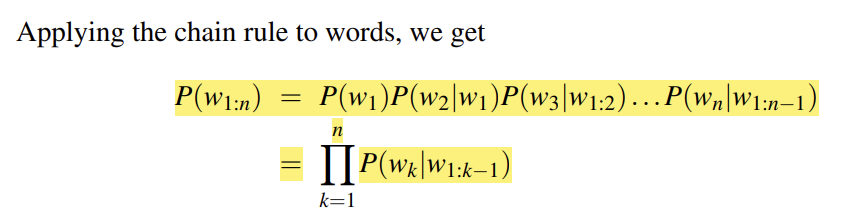
在实操的时候，我们无法得出在某个长sequence出现之后下一个单词出现的概率，因此我们采用马尔科夫假说。
$p(w_n|w_{1:n-1})\approx p(w_n|w_{n-1})$
从而$p(w_{1:n})\approx \prod_{k=1}^{n}p(w_k|w_{k-1})$

而为了估计这个概率值，我们采用频率估计概率的方式，这也符合最大似然估计的原理。
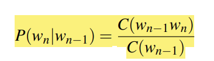

## evaluating:training and test sets
- extrinsic evaluation:建立一个端到端模型，直接在实际应用场景中进行测试
- intrinsic evaluation:用某个数据来量化模型的性能
- training set
- test set : 一定要避免与训练集发生重叠，尤其当测试集污染了训练集之后，就会出现data contamination
- 我们也不能根据在test set 上面的表现调整参数，这同样也是一种会加重模型bias的方法
- development set :调参专用

## perplexity 困惑度，越低越好
$$
\begin{aligned}
perplexity(W)=P(w_1 w_2 w_3 \ldots w_n)^{-\frac{1}{n}}
\end{aligned}
$$

## sampling sentences from a language model
- 语言模型生成一些句子，然后按照它们的概率密度进行抽样
这是可视化一个语言模型的重要方法

## Generalizing vs overfitting the training set
- 训练数据的体裁要尽可能接近我们要部署的任务的体裁
- 使用适当的方言或者变体来构建数据集

## Smoothing, Interpolation and Backoff
### laplace
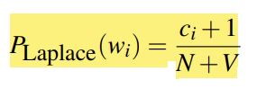
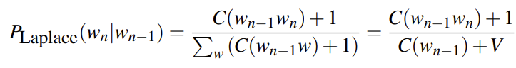
但是这样操作会严重削弱一些常见词语的概率权重
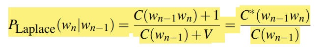
我们可以在现成的数据上用这些数据进行计算。得出新的等价数据量。

>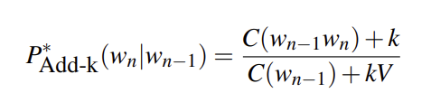
当然我们可以适当优化laplace 平滑，但不多。

### 模型插值
如果我们对某个概率值没有足够的数据量来帮助计算对应的概率，那么我们可以使用与之相关的已知概率进行插值计算。
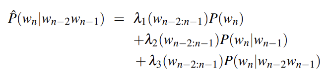

### stupid backoff
逐步回退，减少单词数量，直到遇到有记录的非零概率。
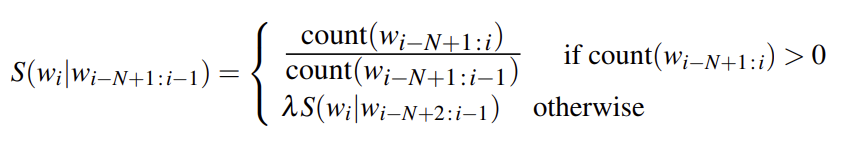

# perplexity's relation to entropy
书接信息论笔记。对于熵这个名词的定义是，在最优编码体系下，对某个信息进行binary code 编码的bit数目的下界。
$H(X)=-\sum_x p(x)\log_2 p(x)$

把这个概念迁移到NLP中，对于一个有n个词语的句子，我们给出它的信息熵的定义。
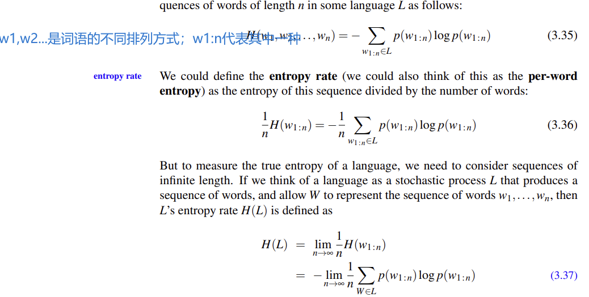

当n无限大的时候，一个句子的entropy rate就可以代表一种语言的信息量。
$H(L)=\lim_{n\to \infty}-\frac{1}{n}\log p(w_{1:n}) $

## cross-entropy
当我们并不了解生成一些数据的信息源的分布p的时候，我们使用模型m进行建模逼近p的分布。
定义p和m的交叉熵
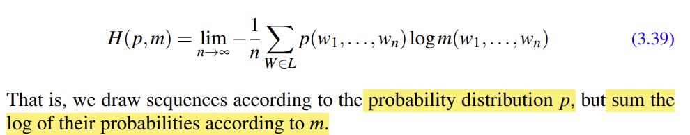
而在NLP领域，为了简便，我们可以通过不断从我们自己构建的模型m里面取样，来逼近交叉熵。
$H(L)=\lim_{n\to \infty}-\frac{1}{n}\log m(w_{1:n}) $

根据信息论上课证明的内容，我们可以得知$H(p)\le H(p,m)$。而显然，在优化的过程中，我们希望交叉熵不断降低，直到接近乃至等于p本来的信息熵。

我们使用的是贝叶斯建模方式，因此在我们的模型里面，$M=P(w_i|w_{i-N+1:i-1})$。
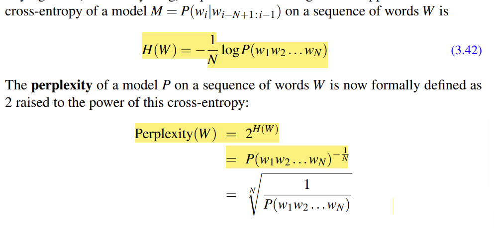