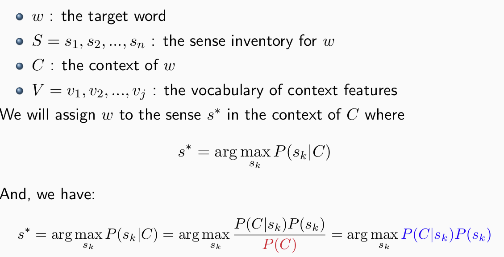
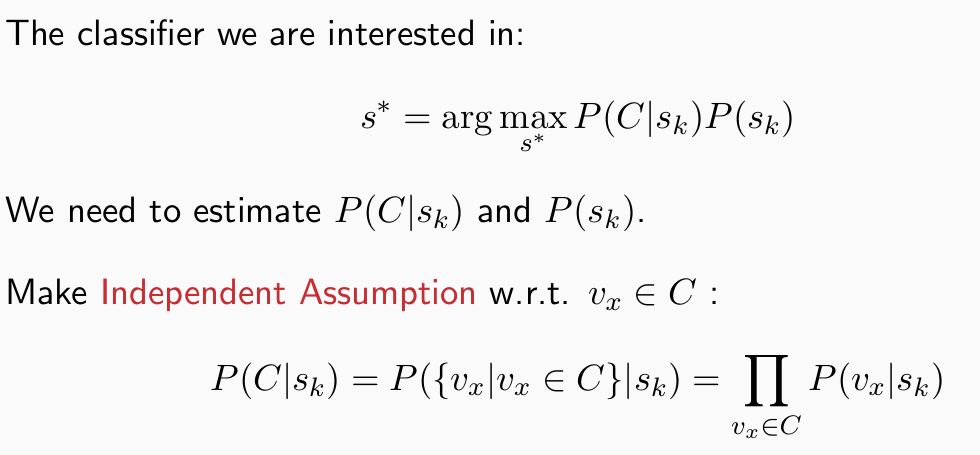
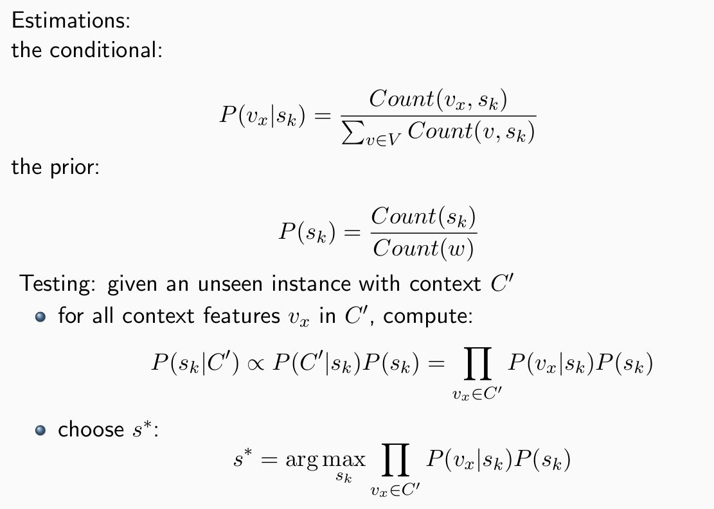

# Word Sense Disambiguation
## Semi-supervised learning
- 选取一些比较典型的手工标注数据作为种子
- 使用bootstrap采样法获得更多数据样本
    - 从现有分类器中选出置信程度最高的K个
    - 利用现有的样本去设计新的规则，然后使用新的规则下的分类器去进一步选取新的样本
- 重复上述过程

# 朴素贝叶斯模型
## 公式
我们现在面临的问题是，给定一个语句，判断其中某个单词在这个语句中的语义。

## 模型评估
这个表格比较容易绕，所以需要特别记忆。
首先我们需要把所有数据$X$对应的预测结果$\hat{Y}$和$Y$进行比对，把全部数据分成四类。
TP,FP,FN,TN。
其中TP+TF,FP+FN的含义比较显然，指的是预测对的总数和预测错误的总数。
而TP+FN的意思是原先的数据集里面P的数量，同理TN+FP.
TP+FP的意思是模型预测的P的数量，同理TN+FN.

利用上面的数据，我们可以定义很多衡量的指标。
$$
\begin{aligned}
accuracy&=\frac{tp+tn}{tp+tn+fp+fn}\\
precision_{positive}&=\frac{tp}{tp+fp}\\
recall_{positive}&=\frac{tp}{tp+fn}\\
F_{\beta}&=\frac{(\beta^2+1)Pre*Rec}{\beta^2*Pre+Rec}\\
\end{aligned}
$$
*precision:所有预测为P的数据里面，正确的数目占比是多少*
*recall:所有原始为P的数据，被正确预测为P的数目占比是多少*

# 向模型中注入常识内容
- 在同一篇文档或者同一个对话上下文中，同一个词语往往只表达一种特定的含义。
- 如果一个多义词与某个特定的词语一起出现，那么在这个特定局部组合中，该多义词总是表达一个意思。