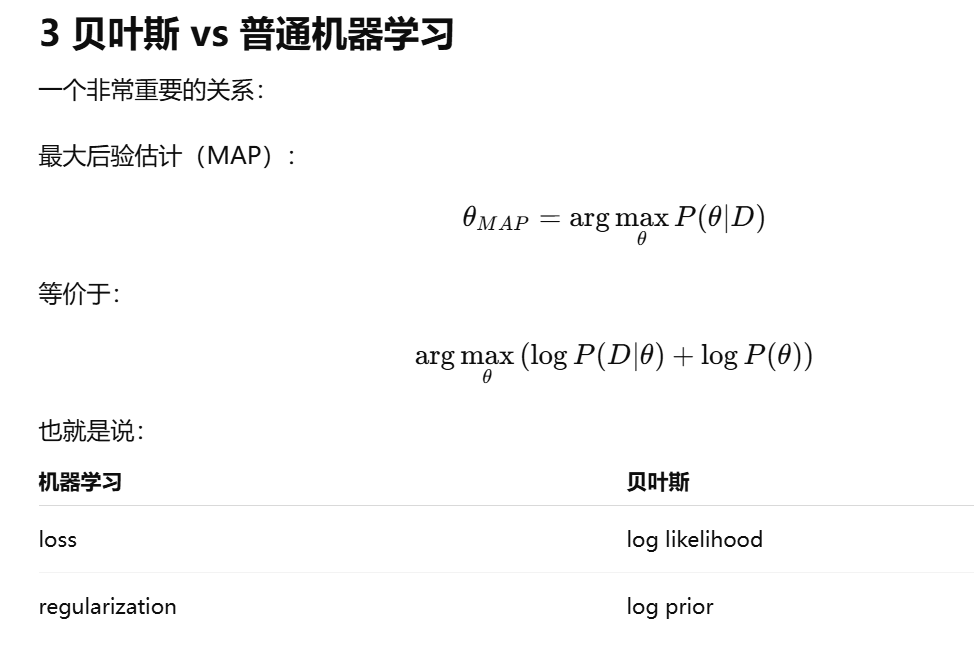
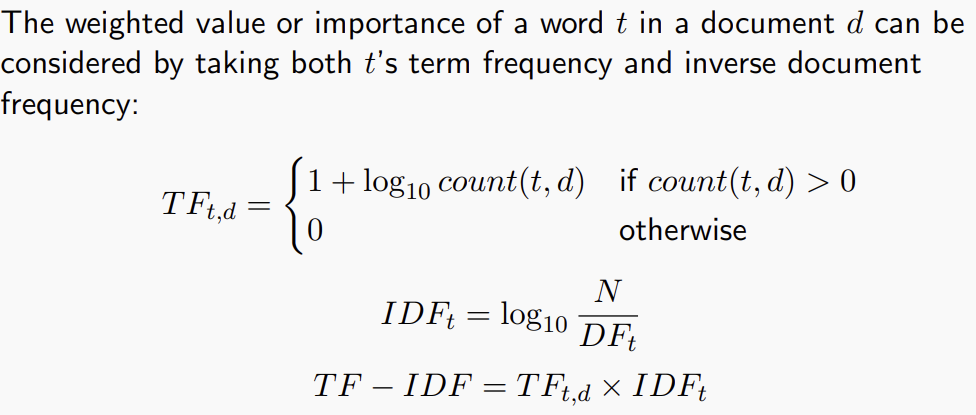
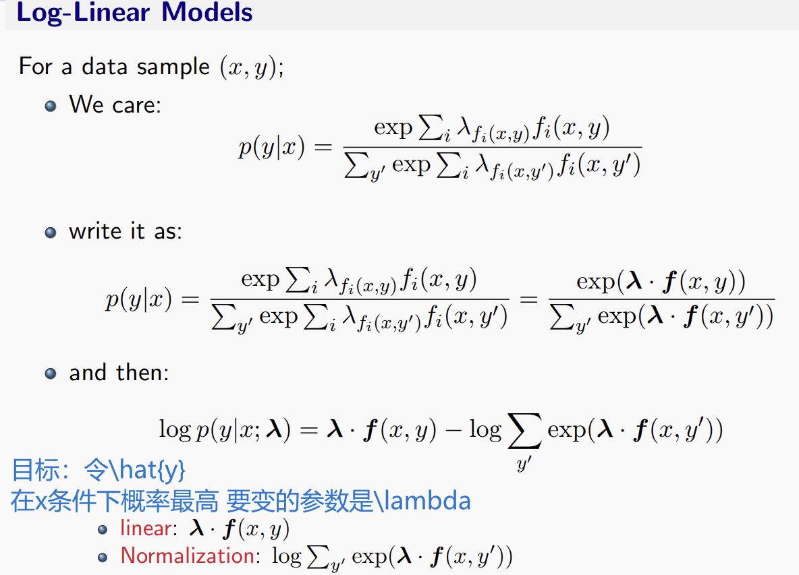
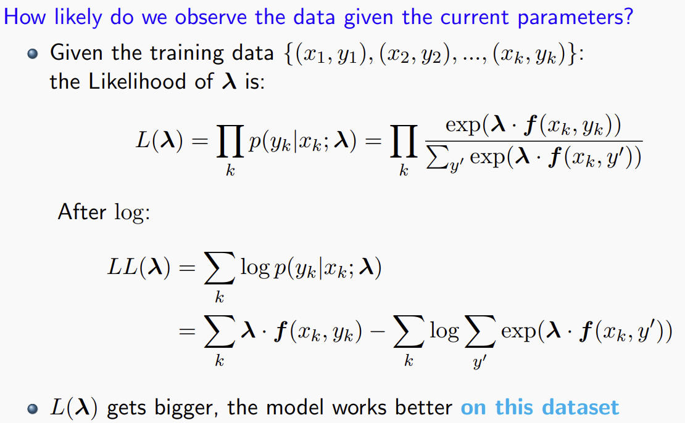
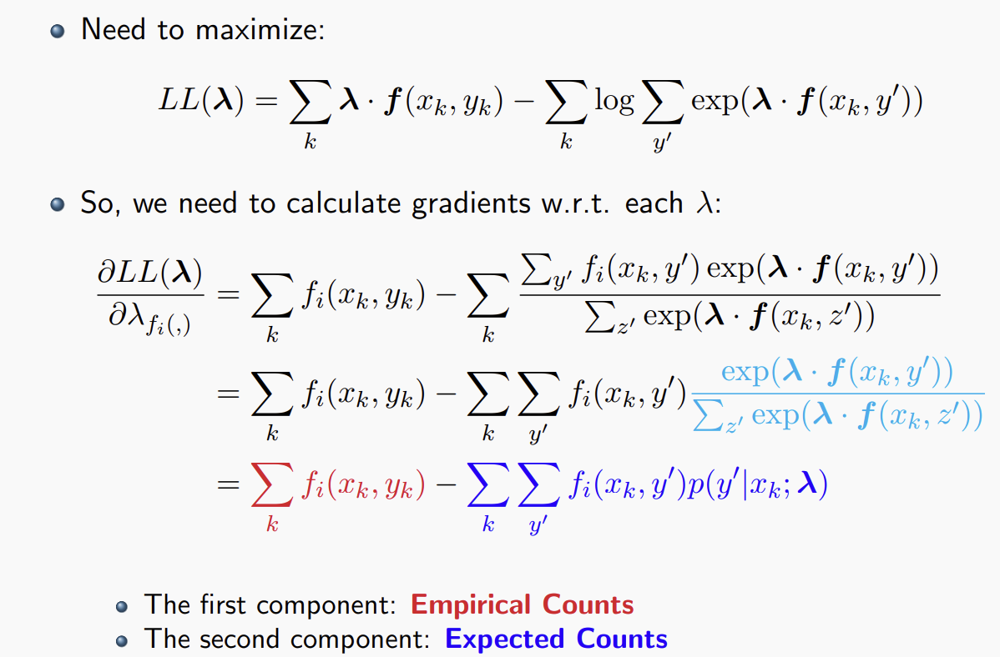

>朴素贝叶斯是生成模型还是判别模型？
- generative: learn $p(x,y)$
- discriminative: learn $p(y|x)$
我们回想WSD问题，我们使用朴素贝叶斯，目标是
$y^{*}=\argmin_{y} p(y|x)=\argmin_y p(x|y)p(y)=\argmin_y p(x,y)$

这里也就是说，尽管我们的目标是条件概率，但是我们的分类器在训练数据上使用统计学习的方法学到的结果并不是条件概率的确切值，而是联合概率密度的分布值。

这就引入了今天的第一个话题
# 贝叶斯建模
把模型中的未知参数当作随机变量，使用概率分布来描述我们对它的信念，然后根据数据不断对这种信念进行更新。

核心公式是
$P(\theta|D)=\frac{P(D|\theta)P(\theta)}{P(D)}$

>贝叶斯相对而言更不容易出现过拟合的情况。

贝叶斯模型的目标函数里面天然就带有一个正则化项。

贝叶斯建模里面，先验概率一般都是人类通过一些基本知识进行建模定义的。
数据生成模型，即参数以什么方式决定数据生成的分布，$P(D|\theta)$也是人为定义的

详见LDA解析文章。

# Feature Representations
判别式模型与生成式模型的区别就决定了判别式模型可以在训练的DATA里面自行添加大量的feature作为原始数据的补充。

对文本中出现的词语进行特征向量的编码：
- one-hot
- 频率
- TF-IDF

>TF-IDF

注意N代表总文档数目，DF代表所有文档里面出现对应词的文章数目

## 词袋模型
只统计词语的数量以及每个词语的重要性，不考虑词语出现的顺序

# 基于特征的判别模型

通过把score转化为probability，然后我们就定义出了我们想要去优化的函数。

这样，我们就为这个数学意义上的偏导置0的式子赋予了概率上的现实意义：让实际训练数据中的特征出现次数等于在参数$\lambda$下对应的特征出现的期望。

*这本质上要求的是参数对训练数据的完美拟合*

