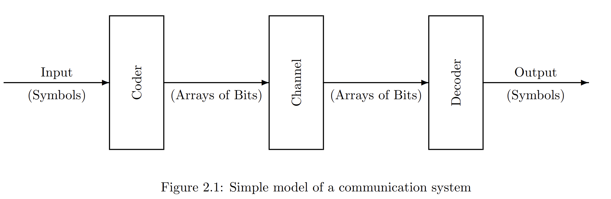

# Codes

对某类事物开展编码之前，首先我们需要明确这个事物的性质
- 是否是2的幂
- 有限
- 无限，可数
- 无限，不可数

其中无限且不可数是最难进行编码的，但是我们诚然可以使用离散化的方式对区间数据近似表示，当然这样编码是有损且不可逆的。
further:电脑的浮点数表示

## 对Code的空余容量的利用
- 忽略
- 映射到其它合法数值
- 留着
- 用于一些控制码，比如ascii
- 用于一些常用词语的缩写记录，比如 and , the

>IP Address
IPV4:x.x.x.x where each x is a number between 0 and 255
IPV6:x.x.x.x where each x is now a 32-bit number
因此现代的IPV6可以直接容纳每一个硬件设备而完全不用考虑地址不足的问题

## fixed-length和variable-length
固定长度编码可以并行处理，而变长编码则必须找到一个方法去推测不同symbol之间如何划分。
如果一个解码器没有成功捕捉到一串编码的开头或者结尾，那么它就遇到了framing error，而现实中为了减少这种问题的出现，一般会在symbols之间发射stop bits

## Integer Codes
不赘述了，详见后续的CSAPP。

