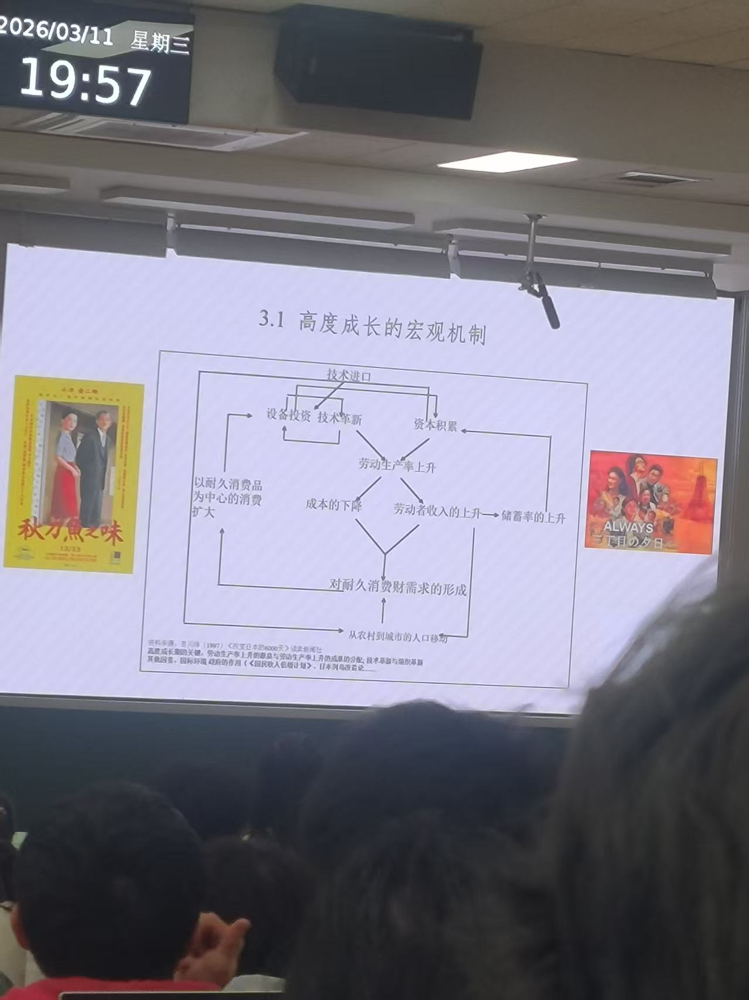

>为什么商学院在英美流行而在德日不流行？
商学院课表：财务分析+战略策略 —— 能力有没有用
终极管理者的入场券 —— 学位没有用

>商学院可以满足general skill
在美国，对general skill重视程度比较高，因此跳槽多；德国，对行业技能重视程度高，跳槽一般是在行业内部；而在日本，对企业技能重视程度高，很多都是在一个企业集团内部被调来调去。
所以商学院培养的能力在德日并不流行。

>为什么关注日本的高度成长期？
中国改革的早期思路与东亚实践。参考南斯拉夫（不是典型计划经济）和日本。

# 导论1 工业革命vs勤劳革命：日本生产组织方式的起源？
劳动者和技术如何结合，企业生产活动是如何组织起来的

勤劳革命主要发展在农业领域里。走向工业化的资本节约型和劳动密集型（和工业革命相反），通过大量提高劳动力来提高生产效率。

# 导论2 德日制造的前世与今生：经济发展与社会变迁
它们的严谨，并不是一直都有的。
德国：进行逆向工程，山寨英国产品。结果德国产品彻底取代英国产品。
日本：在刚进入工业化的时候，劳动力也不像我们印象中那样的严谨。

# 战后的经济发展
宏观变化：战后复兴、高度成长、稳定成长、泡沫经济、失去的十年、再次复兴、世界金融危机

- 日本和中国投资率都很高
- 日本对FDI外资依存度极低；而中国对FDI依存度、还是很高的，对贸易的依存度也很高
- 日本的基尼系数很低；中国的基尼系数很高。（农村养老金问题，如何提高）
- 日本失业率很低，而中国的失业率较高
- 日本是内需主导，中国经济发展是高度外向的

# 高度成长的前史：后发优势、后发劣势与奥尔森冲击
挤压式发展，只学表面，学深层内容很少。

短暂民主与战时体制->皇室中心主义/国家主义
GHQ体制（美军统治）与日美联盟 （裕仁天皇拜访麦克阿瑟）

>政府承认战争责任。但是，没有制度化地清算，没有制度化地解决战争责任问题，右翼政治家仍然可以跳脚。

>奥尔森冲击：大国往往是超稳定结构，只有战争或者革命才能改变结构。

战后：在美国的“帮助”下日本放弃了战争权，完成了和平宪法。

# 战后改革：社会改革与经济民主化
- 农地改革：自耕农制度，生产率上升，国内市场扩大
- 财阀解体：解散财阀总部，放逐旧管理者，新经营管理群体的出现
- 劳动改革：劳动三权与劳动权利；废除身份差别；企业内工会

这三条都提高了劳动生产率。

>德日的后发劣势：深层权力问题解决的不好。
宫崎骏：喜欢日本的自然，而非日本国
百田尚树：日本的自然很美，所以要为守护日本而死

>从海德格尔到京都学派，哲学家们为什么一再走入鼓吹战争的迷途？

## 从混乱到复兴
- 战后：优先恢复钢和煤炭，倾斜生产方式，但是带来通货膨胀
- 道奇路线：超级均衡预算，强化税收，结果经济紧缩，带来企业危机（丰田事件，丰田破产）
- 朝鲜特需：朝鲜战争，美军后勤产品在日本生产，极快加速经济复苏
- 1956：战后期结束

# 高度成长的机制
*资本主义的黄金时代：耐久消费品迅速普及*
## 宏观逻辑

## 微观基础
现代管理方法的全面引进和创造性改造
- 从精英主义的品质管理到大众主义的质量管理。从专家为中心到全体公司员工参与的管理方式。
>为什么改造是成功的？

- 从品质管理到组织革新。精益生产方式——（丰田TPS:多车型小批量生产）

# 社会变化
- 寿命增加
- 人口移动：劳动力进入大城市
- 住宅问题
- 从政治运动到以经济为中心

# 高度成长的终结
三种可能的解释：
- 进口技术枯竭
- 石油危机
- 内需普及结束

>在战后高度成长期，后发优势与后发劣势体现在哪里？

>谁决定了战后高度成长期的走向，创造历史的是大人物还是普通人？（什么样的叙事方式？）

