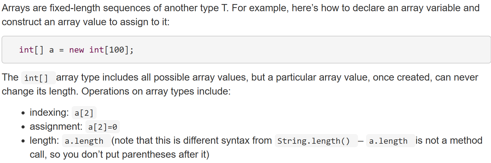
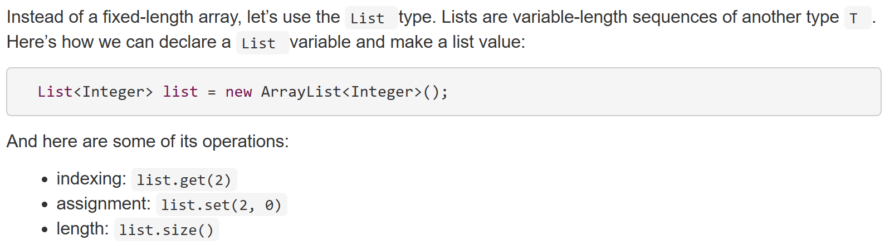
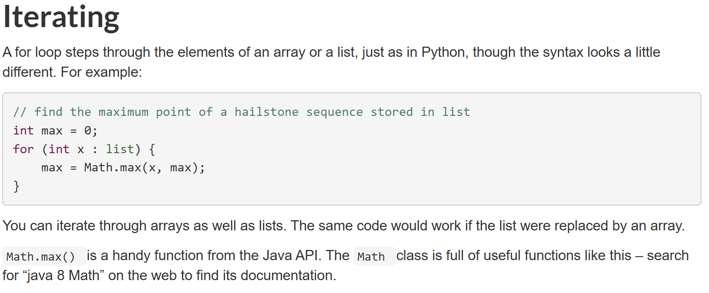
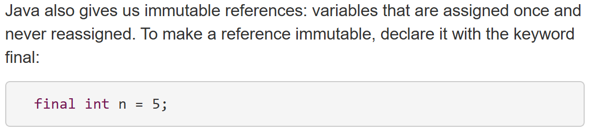

# Static Checking
静态类型是一种编程语言的类型检查方式，变量的类型在编译阶段就确定，并且在运行前进行类型检查。

JAVA是一个静态类型语言。

代码通常有静态检查和动态检查两种检查方式。

## 存储结构

然而由于数组的大小是手动指定的，因此我们无法避免运行过程中可能出现的溢出情况，这就是编程的不安全性的体现。


*在java中，每个原始数据类型，比如int，都对应一个对象类型，比如Integer*

如果需要在一个list里面进行迭代的话，那么：


## 类方法
在java中，所有的语句statement必须属于一个method，而所有的method必须属于一个类class。

- static 意味着这个method本身不会接受一个self作为参数。
如果是已经有了一个list对象l，```l.add()```就不是一个静态函数；而静态函数需要引用对应的类名。
```Hailstone.hailstoneSequence(83)```

注释也同样重要，尤其需要强调一些在静态检查的时候无法被检查出的信息。

## 改变对象内容和改变对象指向
在本节课中,immutability是一个很重要的概念。


程序的书写必须有两个目的：
- 和计算机沟通
- 和其他人沟通

而课程的目标是
>- Safe from bugs . Correctness (correct behavior right now), and defensiveness (correct behavior in the future).
>- Easy to understand . Has to communicate to future programmers who need to understand it and make changes in it (fixing bugs or adding new features). That future programmer might be you, months or years from now. You’ll be surprised how much you forget if you don’t write it down, and how much it helps your own future self to have a good design.
>- Ready for change . Software always changes. Some designs make it easy to make changes; others require throwing away and rewriting a lot of code.
