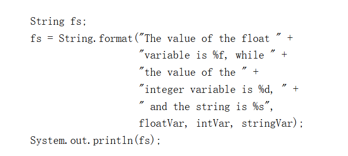
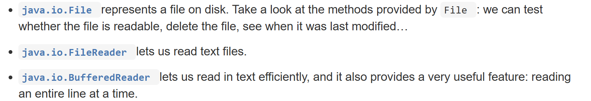

# Strings

```str.length()```
```str.charAt(i)```
```str1.concat(str2)```



# class and objects
```java
public class Bicycle {
        
    // the Bicycle class has
    // three fields
    public int cadence;
    public int gear;
    public int speed;
        
    // the Bicycle class has
    // one constructor
    public Bicycle(int startCadence, int startSpeed, int startGear) {
        gear = startGear;
        cadence = startCadence;
        speed = startSpeed;
    }
        
    // the Bicycle class has
    // four methods
    public void setCadence(int newValue) {
        cadence = newValue;
    }
        
    public void setGear(int newValue) {
        gear = newValue;
    }
        
    public void applyBrake(int decrement) {
        speed -= decrement;
    }
        
    public void speedUp(int increment) {
        speed += increment;
    }
        
}

public class MountainBike extends Bicycle {
        
    // the MountainBike subclass has
    // one field
    public int seatHeight;

    // the MountainBike subclass has
    // one constructor
    public MountainBike(int startHeight, int startCadence,
                        int startSpeed, int startGear) {
        super(startCadence, startSpeed, startGear);
        seatHeight = startHeight;
    }   
        
    // the MountainBike subclass has
    // one method
    public void setHeight(int newValue) {
        seatHeight = newValue;
    }   

}
```
## 嵌套类
```java
class OuterClass {
    ...
    class InnerClass {
        ...
    }
    static class StaticNestedClass {
        ...
    }
}
```

# SQL
```java
List<String> cities;        // a List of Strings
Set<Integer> numbers;       // a Set of Integers
Map<String,Turtle> turtles; // a Map with String keys and Turtle values

List<String> firstNames = new ArrayList<>();
List<String> lastNames = new LinkedList<>();

Set<Integer> numbers = new HashSet<>();
Map<String,Turtle> turtles = new HashMap<>();

```
```java
for (String city : cities) {
    System.out.println(city);
}

for (int num : numbers) {
    System.out.println(num);
}
for (String key : turtles.keySet()) {
    System.out.println(key + ": " + turtles.get(key));
}
```

