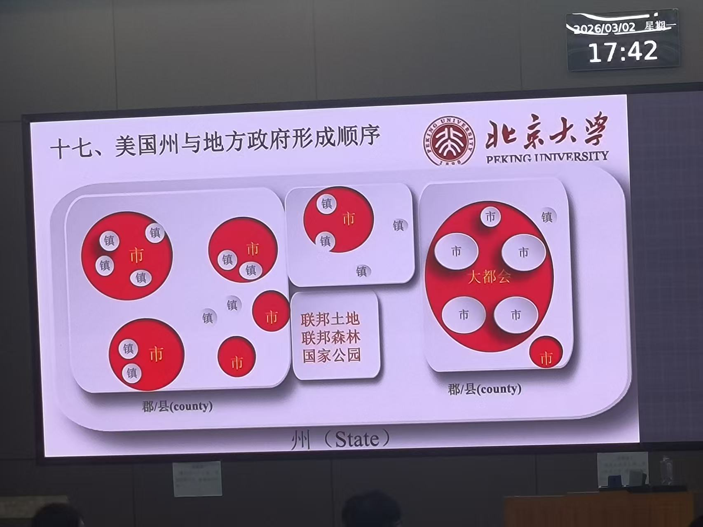

# 课程引入
引入：
- G20芬太尼——需要贴近生活常识、生活细节进行国际关系的研究。
- 对于美国普通人来说，美中关系并没有那么重要，他们日常生活中有更多的问题需要考虑，比如移民问题。
- 美国社会精英对于美国自己的社会治理也没有什么信心。

## 公共政策的定义
- 政治：关于权力的关系。权力分配，冲突与妥协
- 公共政策：为了公共治理制定的一系列法律和实践措施。

## 如何应用公共政策视角
- 需要划分社会管理领域，应对各种社会问题无法采用一刀切的公共政策解决。
- 公共政策和社会治理的核心是收集充足的资金。
- 甄别问题的背景或者原因比解决问题的方式更加重要。

## 两大核心支线
1. **警察**（暴力震慑）
2. **预算**（税收体系）

2020年，美国爆发了“黑命贵”的反抗运动，进一步引发了很多对美国历史奴隶制的探讨，很多名人塑像都遭受到了巨大的破坏。
林肯也曾经是奴隶主。美国派出警卫队守卫林肯纪念堂。
Freedom is not Free.
民主背后如果没有强大的暴力震慑，那么它是没有存在的可能的。

# 美国联邦制
## 联邦制概况
是由两个以上具有一定主权的政治实体签署统一宪法，建立跨境的中央政府。
通俗理解，美国总统无法强行任免每个州的州长的职位。

中央对地方的控制：
- **财政预算控制**
美国联邦政府拿走所有税收的60%左右。这是一个相对比较高的比例。
特朗普现在对于支持自己的州多投钱，不支持的州少投钱。
- **人事管理模式**

美国所谓的州，其实state的真实意义就是“国”，这也正是为什么美国被称为美利坚合众国。

## 美国联邦政府和州政府的总关系
**总趋势**
联邦政府权力不断扩大。
### 总统
- 建立全国行政机构,如FBI，使得联邦政府权力不断下渗
- 约束州政府权力
### 国会
- 指定宪法和宪法修正案，以立法形式确定巩固增强联邦权力
### 最高法院
- 支持联邦政府的最高法律裁决
- 约束州政府的法律裁决倾向

三权分立，但是不是三权分裂。甭管怎么分，都是一伙的，顶级的捕食者——社会精英的核心利益是一体的。（详见爱泼斯坦事件）

>q-a
>- 为什么最初会产生一个中央政府？
因为美国建国初期，还面临着英国的诸多威胁。需要一个中央的政府统一应对外界的威胁。
>- 美国的立国之根，资金来源，就是关税。
>- 而现在美国85%的税收来源，是个税。因此现在美国联邦政府很注重就业率。

## 州政府如何影响联邦政府
1. 游说
2. 监督立法
3. 行政豁免
4. 公开拒绝
5. 州政府对联邦诉讼（但是被最高法院大部分驳回了）
6. 脱离联邦（直接内战）

## 联邦政府与地方政府合作的核心
1. 建立共享档案，如人口档案
2. 联邦政府在各地建立联邦政府的行政机构，为当地提供直接与联邦政府交流的渠道
3. 资金援助和补贴
4. 联邦债券和贷款
5. 项目专项援助

>对抗
德克萨斯州，入境处，移民母子淹死。联邦政府和州政府相互推卸责任。
这也正体现了美国联邦制的一大问题，常态时期责权清晰，危机时期则相互推诿，争权夺利。

>美国死刑
判决之后大概要15-20年才执行。
示例：Karla Faye Tucker，杀人犯，在监狱信教、忏悔、捐款。当时舆论造势希望赦免她。而是否执行死刑的权力归属于州长。
而小布什当时作为德克萨斯州长，顶住舆论压力，坚持执行死刑。这使得他声望大增。

## 美国州的权力
- 法律类：允许什么不允许什么
- 行政权力：州税、州立教育、紧急救助、公共建设、卫生检疫
- 证照类：驾照、车牌、出生和死亡证明、各类许可

## 美国县/郡政府权力
- 司法与执法：监狱，治安，验尸官，法医
- 行政事务：征税

为了解决三不管区域问题，联邦设置了郡县，而这些区域大多数由联邦管理，地方是不怎么管的。

